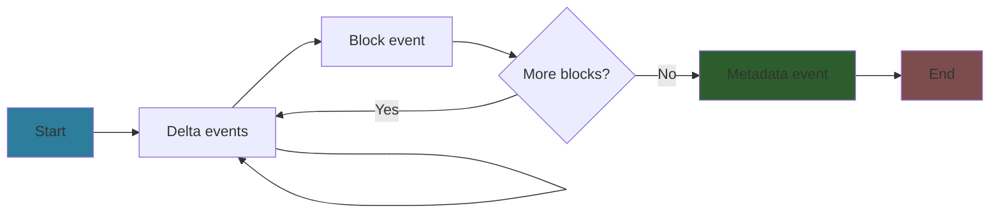
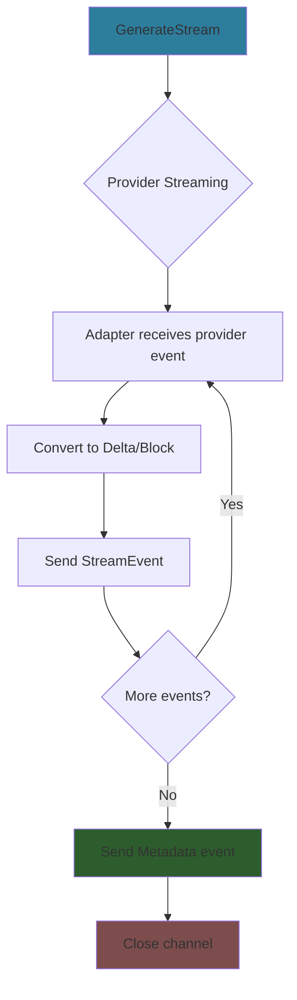

# Streaming

Real-time LLM response streaming with deltas and complete blocks.

## Quick Start

```go
stream, err := provider.GenerateStream(ctx, req)
if err != nil {
    return err
}
defer stream.Close()

for event := range stream.Events() {
    if event.Error != nil {
        return event.Error
    }

    if event.Delta != nil {
        // Incremental content for real-time UI
        fmt.Printf("Delta: %s\n", event.Delta.DeltaType)
    }

    if event.Block != nil {
        // Complete block ready for persistence
        fmt.Printf("Block: %s\n", event.Block.BlockType)
    }

    if event.Metadata != nil {
        // Final metadata (last event)
        fmt.Printf("Done. Tokens: %d\n", event.Metadata.OutputTokens)
    }
}
```

## StreamEvent

Each streaming event contains one of:

```go
type StreamEvent struct {
    Delta    *BlockDelta       // Incremental content (or nil)
    Block    *Block            // Complete block (or nil)
    Metadata *StreamMetadata   // Final metadata (or nil)
    Error    error             // Error (or nil)
}
```

**Event flow:**



## BlockDelta

Incremental content updates for real-time UI:

```go
type BlockDelta struct {
    DeltaType       string  // Delta type (see table below)
    BlockIndex      int     // Which block this delta belongs to
    TextDelta       *string // Incremental text (or nil)
    InputJSONDelta  *string // Incremental tool input JSON (or nil)
    ToolCallID      *string // Tool call ID (or nil)
    ToolCallName    *string // Tool name (or nil)
    // ... other delta fields
}
```

### Delta Types

| DeltaType | Used For | Fields | Example |
|-----------|----------|--------|---------|
| `text_delta` | Text block | `TextDelta` | `{DeltaType: "text_delta", TextDelta: "Hello"}` |
| `thinking_delta` | Thinking block | `TextDelta` | `{DeltaType: "thinking_delta", TextDelta: "Analyzing..."}` |
| `tool_call_start` | Tool use block | `ToolCallID`, `ToolCallName` | `{DeltaType: "tool_call_start", ToolCallID: "call_123", ToolCallName: "search"}` |
| `input_json_delta` | Tool use block | `InputJSONDelta` | `{DeltaType: "input_json_delta", InputJSONDelta: "{\"query\":\""}` |
| `tool_result_start` | Web search result | `ToolCallID` (via metadata) | `{DeltaType: "tool_result_start"}` |
| `usage_delta` | Turn metadata | `InputTokens`, `OutputTokens` | `{DeltaType: "usage_delta", OutputTokens: 150}` |

## Complete Blocks

When a block finishes, you receive a complete `Block`:

```go
if event.Block != nil {
    // Block is complete and normalized
    // Ready for database persistence
    switch event.Block.BlockType {
    case llm.BlockTypeText:
        saveTextBlock(event.Block)
    case llm.BlockTypeToolUse:
        executeToolAndContinue(event.Block)
    case llm.BlockTypeWebSearchResult:
        displaySearchResults(event.Block)
    }
}
```

See [blocks.md](blocks.md) for all block types and schemas.

## Stream Metadata

Final event contains completion metadata:

```go
type StreamMetadata struct {
    Model            string  // Actual model used
    InputTokens      int     // Input tokens
    OutputTokens     int     // Output tokens
    StopReason       string  // Why it stopped ("end_turn", "max_tokens", "tool_use")
    ResponseMetadata map[string]interface{} // Provider-specific data
}
```

Example:
```go
if event.Metadata != nil {
    log.Printf("Completed: %d tokens, reason: %s",
        event.Metadata.OutputTokens,
        event.Metadata.StopReason)
}
```

## Error Handling

Errors can occur at any point:

```go
for event := range stream.Events() {
    if event.Error != nil {
        var llmErr *llm.LLMError
        if errors.As(event.Error, &llmErr) {
            // Normalized error with category and retryability
            log.Printf("LLM error: %s (retryable: %t)",
                llmErr.Category, llmErr.Retryable)
        }
        return event.Error
    }

    // Process event...
}
```

See [errors.md](errors.md) for error categories and handling.

## Streaming with Tools

### Server-Side Tools (web_search)

Provider executes automatically, results stream back:

```go
stream, _ := provider.GenerateStream(ctx, req)

for event := range stream.Events() {
    if event.Delta != nil && event.Delta.DeltaType == "tool_result_start" {
        fmt.Println("Search starting...")
    }

    if event.Block != nil && event.Block.BlockType == llm.BlockTypeWebSearchResult {
        // Complete search results
        results := event.Block.Content["results"]
        displaySearchResults(results)
    }
}
```

### Client-Side Tools (bash, custom)

You must execute and stream result back:

```go
stream, _ := provider.GenerateStream(ctx, req)

for event := range stream.Events() {
    if event.Block != nil && event.Block.BlockType == llm.BlockTypeToolUse {
        toolName, _ := event.Block.GetToolName()
        toolInput, _ := event.Block.GetToolInput()
        toolUseID, _ := event.Block.GetToolUseID()

        // Execute tool
        result := executeTool(toolName, toolInput)

        // Create result block
        resultBlock := &llm.Block{
            BlockType: llm.BlockTypeToolResult,
            Content: map[string]interface{}{
                "tool_use_id": toolUseID,
                "is_error":    false,
            },
            TextContent: &result,
        }

        // Continue conversation with tool result
        req2 := &llm.GenerateRequest{
            Model: req.Model,
            Messages: append(originalMessages,
                llm.Message{Role: llm.RoleAssistant, Blocks: allBlocks},
                llm.Message{Role: llm.RoleUser, Blocks: []*llm.Block{resultBlock}},
            ),
        }

        // Stream continuation
        stream2, _ := provider.GenerateStream(ctx, req2)
        // ... process stream2
    }
}
```

## Advanced Patterns

### Accumulating Text

```go
var textBuffer strings.Builder

for event := range stream.Events() {
    if event.Delta != nil && event.Delta.TextDelta != nil {
        textBuffer.WriteString(*event.Delta.TextDelta)
        updateUI(textBuffer.String()) // Update in real-time
    }

    if event.Block != nil && event.Block.BlockType == llm.BlockTypeText {
        // Block contains complete text
        finalText := *event.Block.TextContent
        saveToDatabase(finalText)
    }
}
```

### Multiple Blocks

```go
var blocks []*llm.Block

for event := range stream.Events() {
    if event.Block != nil {
        blocks = append(blocks, event.Block)
    }

    if event.Metadata != nil {
        // All blocks complete
        log.Printf("Received %d blocks", len(blocks))
    }
}
```

### Cancellation

```go
ctx, cancel := context.WithCancel(context.Background())
defer cancel()

stream, _ := provider.GenerateStream(ctx, req)

// Cancel from another goroutine
go func() {
    <-stopSignal
    cancel() // Stops streaming
}()

for event := range stream.Events() {
    // Will exit when context cancelled
}
```

## Provider Differences

The library normalizes provider streaming into consistent `StreamEvent` format:

| Provider | Native Format | Normalized To |
|----------|--------------|---------------|
| **Anthropic** | SSE with `content_block_*` events | `BlockDelta` + `Block` |
| **OpenAI** | JSON chunks with `delta` | `BlockDelta` + `Block` |
| **Gemini** | `GenerateContentResponseChunk` | `BlockDelta` + `Block` |

All providers produce the same `StreamEvent` structure.

## Stream Lifecycle



## API Reference

**Types:**
- `StreamEvent` - Container for delta, block, metadata, or error
- `BlockDelta` - Incremental content update
- `StreamMetadata` - Final completion data

**Methods:**
- `provider.GenerateStream(ctx, req) (*Stream, error)` - Start streaming
- `stream.Events() <-chan StreamEvent` - Event channel
- `stream.Close() error` - Close stream (auto-closes on completion)

**See:** `streaming.go`, `types.go`

## Examples

See `examples/` directory:
- `examples/anthropic-streaming/` - Basic streaming
- `examples/anthropic-thinking/` - Streaming with extended thinking

## Related

- [blocks.md](blocks.md) - Block types and content schemas
- [tools.md](tools.md) - Tool execution in streaming
- [errors.md](errors.md) - Error handling

For **backend streaming architecture** (SSE, catchup, persistence), see:
- `../../_docs/technical/backend/architecture/streaming-architecture.md`
