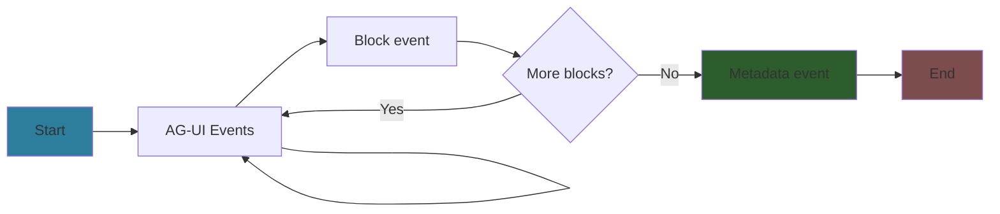
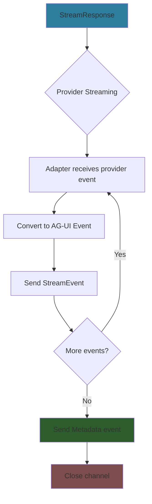

# Streaming (AG-UI Protocol)

Real-time LLM response streaming using the AG-UI protocol standard.

## Quick Start

```go
eventChan, err := provider.StreamResponse(ctx, req)
if err != nil {
    return err
}

for event := range eventChan {
    if event.Error != nil {
        return event.Error
    }

    // Handle AG-UI text events
    if content, ok := event.GetTextMessageContent(); ok {
        fmt.Print(content.Delta)
    }

    // Handle complete blocks (for persistence)
    if event.Block != nil {
        saveBlock(event.Block)
    }

    // Final metadata (last event)
    if event.Metadata != nil {
        fmt.Printf("Done. Tokens: %d\n", event.Metadata.OutputTokens)
    }
}
```

## StreamEvent

Each streaming event contains AG-UI protocol events plus Meridian-specific fields:

```go
type StreamEvent struct {
    Event    events.Event       // AG-UI protocol event (see below)
    Block    *Block             // Complete block for persistence
    Metadata *StreamMetadata    // Final response metadata
    Error    error              // Error (if any)
}
```

**Event flow:**


```mermaid
graph LR
    A[Start] --> B[AG-UI Events]
    B --> B
    B --> C[Block event]
    C --> D{More blocks?}
    D -->|Yes| B
    D -->|No| E[Metadata event]
    E --> F[End]

    style A fill:#2d7d9d
    style E fill:#2d5d2d
    style F fill:#7d4d4d
```

## AG-UI Event Types

The library uses the [AG-UI Protocol](https://github.com/ag-ui-protocol/ag-ui) for streaming events:

### Text Message Events

| Event Type | Purpose | Key Fields |
|-----------|---------|------------|
| `TEXT_MESSAGE_START` | Text block started | `MessageID`, `Role` |
| `TEXT_MESSAGE_CONTENT` | Incremental text | `MessageID`, `Delta` |
| `TEXT_MESSAGE_END` | Text block complete | `MessageID` |

### Thinking Events (Extended Thinking)

| Event Type | Purpose | Key Fields |
|-----------|---------|------------|
| `THINKING_START` | Thinking phase started | `Title` (optional) |
| `THINKING_TEXT_MESSAGE_START` | Thinking text started | - |
| `THINKING_TEXT_MESSAGE_CONTENT` | Incremental thinking | `Delta` |
| `THINKING_TEXT_MESSAGE_END` | Thinking text ended | - |
| `THINKING_END` | Thinking phase complete | - |

### Tool Call Events

| Event Type | Purpose | Key Fields |
|-----------|---------|------------|
| `TOOL_CALL_START` | Tool call started | `ToolCallID`, `ToolCallName`, `ParentMessageID` |
| `TOOL_CALL_ARGS` | Incremental JSON args | `ToolCallID`, `Delta` |
| `TOOL_CALL_END` | Tool call complete | `ToolCallID` |
| `TOOL_CALL_RESULT` | Tool execution result | `ToolCallID`, `Content` |

### Lifecycle Events

| Event Type | Purpose | Key Fields |
|-----------|---------|------------|
| `RUN_STARTED` | Run/turn started | `RunID`, `ThreadID` |
| `RUN_FINISHED` | Run completed successfully | `RunID` |
| `RUN_ERROR` | Run failed | `Message`, `RunID` |
| `STEP_STARTED` | Step started (e.g., LLM call) | `StepName` |
| `STEP_FINISHED` | Step completed | `StepName` |

## Type-Safe Accessors

StreamEvent provides type-safe accessors for AG-UI events:

```go
for event := range eventChan {
    // Text content
    if content, ok := event.GetTextMessageContent(); ok {
        fmt.Print(content.Delta)
    }

    // Thinking content
    if thinking, ok := event.GetThinkingTextMessageContent(); ok {
        fmt.Printf("[thinking] %s", thinking.Delta)
    }

    // Tool call start
    if toolStart, ok := event.GetToolCallStart(); ok {
        fmt.Printf("Calling tool: %s\n", toolStart.ToolCallName)
    }

    // Tool call args (JSON delta)
    if toolArgs, ok := event.GetToolCallArgs(); ok {
        jsonBuffer.WriteString(toolArgs.Delta)
    }
}
```

**Available accessors:**
- `GetTextMessageStart()`, `GetTextMessageContent()`, `GetTextMessageEnd()`
- `GetThinkingStart()`, `GetThinkingTextMessageContent()`, `GetThinkingEnd()`
- `GetToolCallStart()`, `GetToolCallArgs()`, `GetToolCallEnd()`
- `GetRunStarted()`, `GetRunFinished()`, `GetRunError()`
- `GetStepStarted()`, `GetStepFinished()`

## Complete Blocks

When a block finishes streaming, you receive a complete `Block` for persistence:

```go
if event.Block != nil {
    switch event.Block.BlockType {
    case llm.BlockTypeText:
        saveTextBlock(event.Block)
    case llm.BlockTypeToolUse:
        executeToolAndContinue(event.Block)
    case llm.BlockTypeThinking:
        saveThinkingBlock(event.Block)
    }
}
```

See [blocks.md](blocks.md) for all block types and schemas.

## Stream Metadata

Final event contains completion metadata:

```go
type StreamMetadata struct {
    Model            string
    InputTokens      int
    OutputTokens     int
    StopReason       string  // "end_turn", "max_tokens", "tool_use"
    GenerationID     string  // Provider-specific ID
    ResponseMetadata map[string]interface{}
}
```

## Error Handling

```go
for event := range eventChan {
    if event.Error != nil {
        var llmErr *llmprovider.ProviderError
        if errors.As(event.Error, &llmErr) {
            log.Printf("Provider error: %s (retryable: %t)",
                llmErr.Message, llmErr.Retryable)
        }
        return event.Error
    }
    // Process event...
}
```

See [errors.md](errors.md) for error categories.

## Streaming with Tools

### Tool Call Streaming

```go
var toolInputBuffer strings.Builder

for event := range eventChan {
    // Tool call started
    if start, ok := event.GetToolCallStart(); ok {
        fmt.Printf("Tool: %s (ID: %s)\n", start.ToolCallName, start.ToolCallID)
        toolInputBuffer.Reset()
    }

    // Accumulate JSON args
    if args, ok := event.GetToolCallArgs(); ok {
        toolInputBuffer.WriteString(args.Delta)
    }

    // Tool call complete - execute it
    if end, ok := event.GetToolCallEnd(); ok {
        input := json.Unmarshal(toolInputBuffer.String())
        result := executeTool(end.ToolCallID, input)
        // Continue with tool result...
    }
}
```

### Tool Continuation

```go
// After executing a tool, continue the conversation:
resultBlock := &llmprovider.Block{
    BlockType: llmprovider.BlockTypeToolResult,
    Content: map[string]interface{}{
        "tool_use_id": toolCallID,
        "is_error":    false,
    },
    TextContent: &resultText,
}

// Add tool result and stream continuation
req2 := &llmprovider.GenerateRequest{
    Model: req.Model,
    Messages: append(originalMessages,
        llmprovider.Message{Role: llmprovider.RoleAssistant, Blocks: assistantBlocks},
        llmprovider.Message{Role: llmprovider.RoleUser, Blocks: []*llmprovider.Block{resultBlock}},
    ),
}
eventChan2, _ := provider.StreamResponse(ctx, req2)
```

## EventEmitter (Provider Authors)

When implementing a provider, use `EventEmitter` for consistent AG-UI event emission:

```go
eventChan := make(chan llmprovider.StreamEvent, 10)
emitter := llmprovider.NewEventEmitter(eventChan)

// Emit text message
emitter.TextMessageStart("msg-123", "assistant")
emitter.TextMessageContent("msg-123", "Hello, ")
emitter.TextMessageContent("msg-123", "world!")
emitter.TextMessageEnd("msg-123")

// Emit tool call
emitter.ToolCallStart("call-456", "search", &messageID)
emitter.ToolCallArgs("call-456", `{"query":"test"}`)
emitter.ToolCallEnd("call-456")

// Emit thinking (extended thinking mode)
emitter.ThinkingStart(nil)
emitter.ThinkingTextMessageStart()
emitter.ThinkingTextMessageContent("Analyzing the question...")
emitter.ThinkingTextMessageEnd()
emitter.ThinkingEnd()

// Emit complete block and metadata
emitter.Block(completeBlock)
emitter.Metadata(streamMetadata)
```

## Advanced Patterns

### Accumulating Text

```go
var textBuffer strings.Builder

for event := range eventChan {
    if content, ok := event.GetTextMessageContent(); ok {
        textBuffer.WriteString(content.Delta)
        updateUI(textBuffer.String())
    }

    if event.Block != nil && event.Block.BlockType == llmprovider.BlockTypeText {
        // Block contains complete text
        saveToDatabase(*event.Block.TextContent)
    }
}
```

### Cancellation

```go
ctx, cancel := context.WithCancel(context.Background())
defer cancel()

eventChan, _ := provider.StreamResponse(ctx, req)

// Cancel from another goroutine
go func() {
    <-stopSignal
    cancel() // Stops streaming
}()

for event := range eventChan {
    // Will exit when context cancelled
}
```

## Provider Differences

The library normalizes provider streaming into consistent AG-UI events:

| Provider | Native Format | Normalized To |
|----------|--------------|---------------|
| **Anthropic** | SSE with `content_block_*` | AG-UI events |
| **OpenAI** | JSON chunks with `delta` | AG-UI events |
| **OpenRouter** | OpenAI-compatible | AG-UI events |

All providers produce the same `StreamEvent` structure with AG-UI events.

## Stream Lifecycle


```mermaid
graph TD
    A[StreamResponse] --> B{Provider Streaming}
    B --> C[Adapter receives provider event]
    C --> D[Convert to AG-UI Event]
    D --> E[Send StreamEvent]
    E --> F{More events?}
    F -->|Yes| C
    F -->|No| G[Send Metadata event]
    G --> H[Close channel]

    style A fill:#2d7d9d
    style G fill:#2d5d2d
    style H fill:#7d4d4d
```

## API Reference

**Types:**
- `StreamEvent` - Container for AG-UI event, block, metadata, or error
- `StreamMetadata` - Final completion data
- `EventEmitter` - Helper for emitting AG-UI events

**Accessors:**
- `event.IsAGUIEvent() bool` - Check if event contains AG-UI event
- `event.GetEventType() events.EventType` - Get AG-UI event type
- `event.Get*()` - Type-safe accessors for each event type

**See:** `streaming.go`, `event_emitter.go`

## Examples

See `examples/` directory:
- `examples/anthropic-streaming/` - Basic streaming
- `examples/anthropic-thinking/` - Streaming with extended thinking

## Related

- [blocks.md](blocks.md) - Block types and content schemas
- [tools.md](tools.md) - Tool execution in streaming
- [errors.md](errors.md) - Error handling
- [AG-UI Protocol](https://github.com/ag-ui-protocol/ag-ui) - Event specification

For **backend streaming architecture** (SSE, catchup, persistence), see:
- `../../_docs/technical/backend/architecture/streaming-architecture.md`
